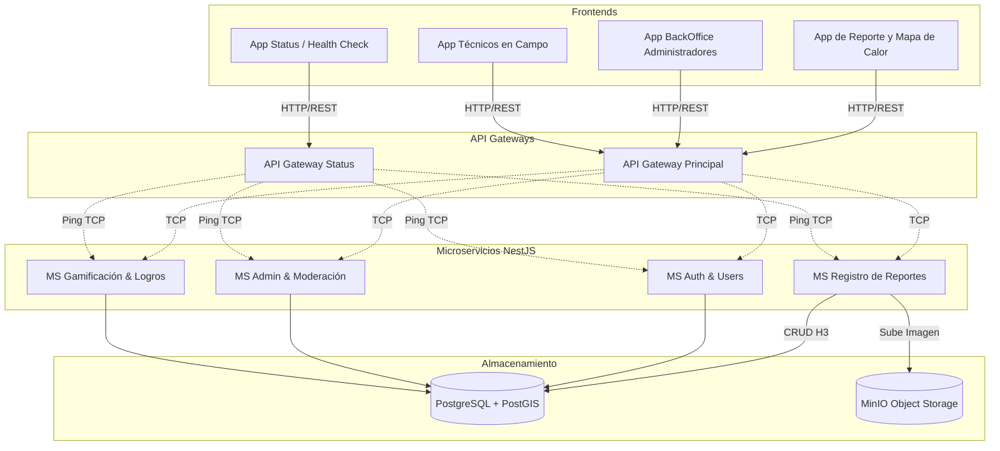

# Arquitectura del Sistema: Ojo Camba

**Descripción:** Este documento detalla la arquitectura de software del sistema Ojo Camba. Define la separación de responsabilidades entre las aplicaciones cliente (Frontends), la capa de enrutamiento (API Gateways), los microservicios backend basados en NestJS y la capa de persistencia de datos (PostgreSQL + MinIO). La comunicación interna prioriza el protocolo TCP para garantizar baja latencia y alto rendimiento.

## Diagrama de Arquitectura General

