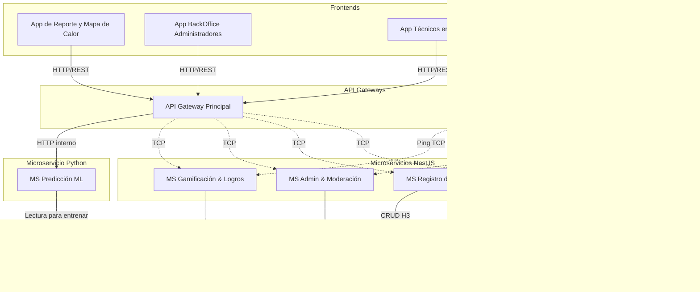

# Arquitectura del Sistema: Ojo Camba

**Descripción:** Este documento detalla la arquitectura de software del sistema Ojo Camba. Define la separación de responsabilidades entre las aplicaciones cliente (Frontends), la capa de enrutamiento (API Gateways), los microservicios backend basados en NestJS y la capa de persistencia de datos (PostgreSQL + MinIO). La comunicación interna prioriza el protocolo TCP para garantizar baja latencia y alto rendimiento.

## Diagrama de Arquitectura General

```mermaid
graph TD
    subgraph Frontends
        AppReporte[App de Reporte y Mapa de Calor]
        AppBackOffice[App BackOffice Administradores]
        AppTecnico[App Técnicos en Campo]
        AppStatus[App Status / Health Check]
    end

    subgraph API Gateways
        GW_Principal[API Gateway Principal]
        GW_Status[API Gateway Status]
    end

    AppReporte -->|HTTP/REST| GW_Principal
    AppBackOffice -->|HTTP/REST| GW_Principal
    AppTecnico -->|HTTP/REST| GW_Principal
    AppStatus -->|HTTP/REST| GW_Status

    subgraph Microservicios NestJS
        MS_Auth[MS Auth & Users]
        MS_Register[MS Registro de Reportes]
        MS_Admin[MS Admin & Moderación]
        MS_Gamify[MS Gamificación & Logros]
    end

    subgraph Microservicio Python
        MS_Prediccion[MS Predicción ML]
    end

    GW_Principal -.->|TCP| MS_Auth
    GW_Principal -.->|TCP| MS_Register
    GW_Principal -.->|TCP| MS_Admin
    GW_Principal -.->|TCP| MS_Gamify
    GW_Principal -->|HTTP interno| MS_Prediccion
    
    GW_Status -.->|Ping TCP| MS_Auth
    GW_Status -.->|Ping TCP| MS_Register
    GW_Status -.->|Ping TCP| MS_Admin
    GW_Status -.->|Ping TCP| MS_Gamify

    subgraph Almacenamiento
        DB[(PostgreSQL + PostGIS)]
        MinIO[(MinIO Object Storage)]
    end

    MS_Register -->|Sube Imagen| MinIO
    MS_Register -->|CRUD H3| DB
    MS_Auth --> DB
    MS_Admin --> DB
    MS_Gamify --> DB
    MS_Prediccion -->|Lectura para entrenar| DB
```

**Por qué `ms-prediccion` habla HTTP y no TCP.** Es el único microservicio en
Python: el pipeline de Machine Learning vive en pandas y scikit-learn, y FastAPI
no habla el protocolo TCP de NestJS. No se publica con dominio propio — se llega
sólo por `gateway-principal`, que es donde se comprueban los roles.

## Endpoints HTTP — Gateway Principal (puerto 3000)

| Método | Ruta | Microservicio | Patrón TCP |
|--------|------|--------------|------------|
| `POST` | `/auth/register` | ms-auth | `auth.register` |
| `POST` | `/auth/login` | ms-auth | `auth.login` |
| `POST` | `/auth/refresh` | ms-auth | `auth.refresh` |
| `POST` | `/auth/logout` | ms-auth | `auth.logout` |
| `POST` | `/auth/validate` | ms-auth | `auth.validate_token` |
| `GET`  | `/auth/profile/:id` | ms-auth | `auth.get_profile` |
| `POST` | `/reportes` | ms-register | `register.create_report` |
| `GET`  | `/reportes` | ms-register | `register.list_reports` |
| `GET`  | `/reportes/heatmap` | ms-register | `register.get_heatmap` |
| `GET`  | `/reportes/heatmap-detailed` | ms-register | `register.get_heatmap_detailed` |
| `POST` | `/reportes/vincular` | ms-register | `register.vincular_device` — body: `{ usuario_id, device_id }` |
| `GET`  | `/reportes/:id` | ms-register | `register.get_report` |
| `GET`  | `/admin/reports/pending` | ms-admin | `admin.list_pending` |
| `POST` | `/admin/reports/:id/accept` | ms-admin | `admin.accept_report` |
| `POST` | `/admin/reports/:id/reject` | ms-admin | `admin.reject_report` |
| `POST` | `/admin/groups` | ms-admin | `admin.create_group` |
| `POST` | `/admin/groups/:id/updates` | ms-admin | `admin.update_case` |
| `POST` | `/admin/devices/ban` | ms-admin | `admin.ban_device` |
| `GET`  | `/admin/groups` | ms-admin | `admin.list_groups` |
| `GET`  | `/admin/groups/heatmap` | ms-admin | `admin.get_groups_heatmap` |
| `GET`  | `/admin/groups/by-cell` | ms-admin | `admin.list_groups_by_cell` |
| `GET`  | `/admin/groups/:id` | ms-admin | `admin.get_group` |
| `GET`  | `/admin/groups/:id/timeline` | ms-admin | `admin.get_case_timeline` |
| `GET`  | `/admin/dashboard` | ms-admin | `admin.dashboard` |
| `GET`  | `/admin/devices` | ms-admin | `admin.list_devices` |
| `GET`  | `/auth/users` | ms-auth | `auth.list_users` |
| `POST` | `/gamify/award` | ms-gamify | `gamify.award_points` |
| `GET`  | `/gamify/stats/:id` | ms-gamify | `gamify.get_user_stats` |
| `GET`  | `/gamify/levels` | ms-gamify | `gamify.get_levels` |
| `GET`  | `/health` | — | — |

### Predicción (ISSUE-31)

Estas rutas no tienen patrón TCP: el gateway hace de proxy HTTP hacia
`ms-prediccion` (`MS_PREDICCION_URL`, por defecto `http://localhost:3007`). El
control de acceso es del gateway.

| Método | Ruta | Rol requerido | Qué devuelve |
|--------|------|---------------|--------------|
| `GET`  | `/prediccion/modelo` | coordinador, autoridad, IT | Métricas comparadas de los tres modelos, procedencia y limitaciones |
| `GET`  | `/prediccion/pronostico` | coordinador, autoridad | Casos esperados por zona H3 y categoría a 7 días, con confianza y margen de error. Filtros: `zona`, `categoria_id` |
| `GET`  | `/prediccion/alertas` | coordinador | Alertas de capacidad al 80% y 100% con recomendación explicable. Filtro: `solo_criticas` (por defecto `true`) |
| `POST` | `/prediccion/entrenar` | IT | Reentrena y vuelve a comparar. Parámetro: `semanas_prueba` (4–26) |

### Panel de decisión (ISSUE-32)

El panel del Backoffice (`/prediccion`) se arma con estas rutas. Las dos
primeras las sirve `ms-admin` por TCP —una decisión es un hecho operativo, no
una salida del modelo—; el gateway compone la comparativa.

| Método | Ruta | Rol requerido | Qué devuelve |
|--------|------|---------------|--------------|
| `GET`  | `/prediccion/comparativa` | coordinador, autoridad | Lo observado y lo estimado **por separado**, cada uno con su origen y su período, más el alineado por zona H3 con la diferencia. Filtros: `desde`, `hasta`, `categoria_id`, `estado` |
| `POST` | `/prediccion/decisiones` | coordinador | Registra aceptar, modificar o descartar una recomendación. Motivo obligatorio |
| `GET`  | `/prediccion/decisiones` | coordinador, autoridad | Historial con precisión retrospectiva: pronóstico, Casos observados y error |

- La comparativa **nunca funde** las dos fuentes en un solo número: si hiciera
  falta la diferencia, viaja aparte con los dos originales al lado.
- Sin modelo entrenado la comparativa igual responde: `estimado` viene en `null`
  con el motivo, y el lado observado se muestra completo. La operación real no
  depende de que alguien haya entrenado.
- La decisión se atribuye al usuario del token, nunca a un id del navegador, y
  guarda una **copia** de la recomendación: se recalcula en cada reentrenamiento
  y para auditar hace falta lo que el coordinador tenía a la vista.
- La autoridad municipal consulta comparativa e historial —son agregados, sin
  fotos ni reportes individuales— pero no llega a `/alertas` ni puede decidir.

Notas de contrato:

- Mientras nadie haya entrenado, las tres rutas de lectura responden **409**, no
  500: es un estado esperado de un despliegue nuevo.
- Si `ms-prediccion` no responde, el gateway devuelve **503** con el motivo.
- Todo pronóstico viaja con `origen: "estimacion"` y la versión de modelo y
  dataset. Una estimación nunca se presenta como observación (ISSUE-32).
- Las alertas son sólo para el coordinador: la autoridad municipal consulta el
  agregado, no las recomendaciones sobre las que se opera.
