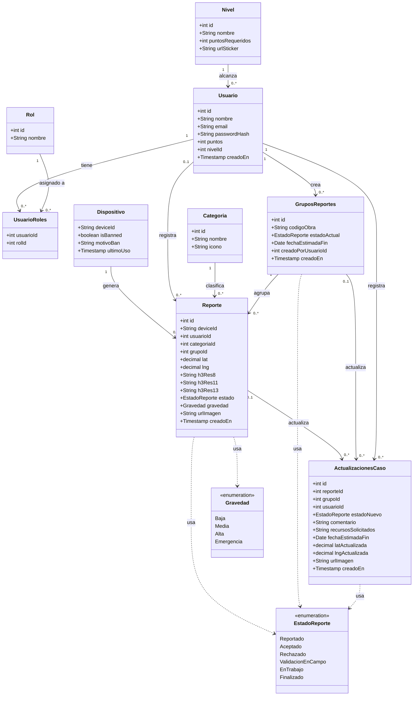
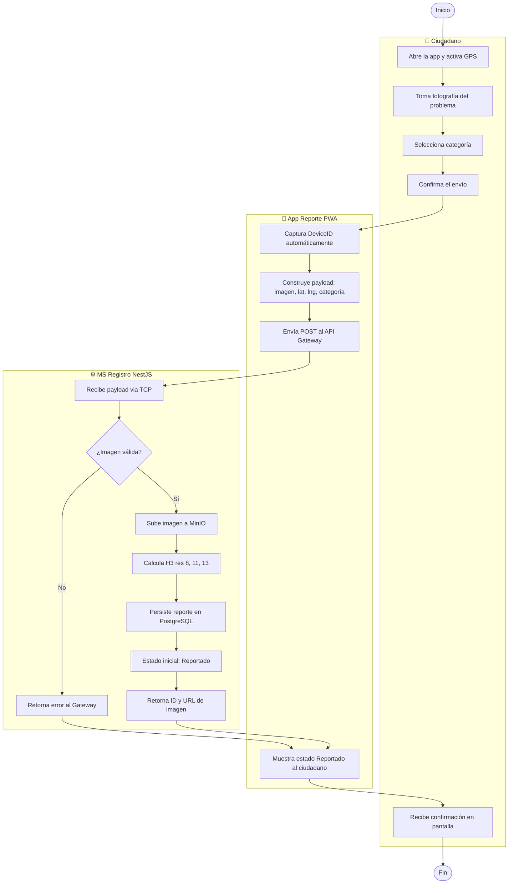
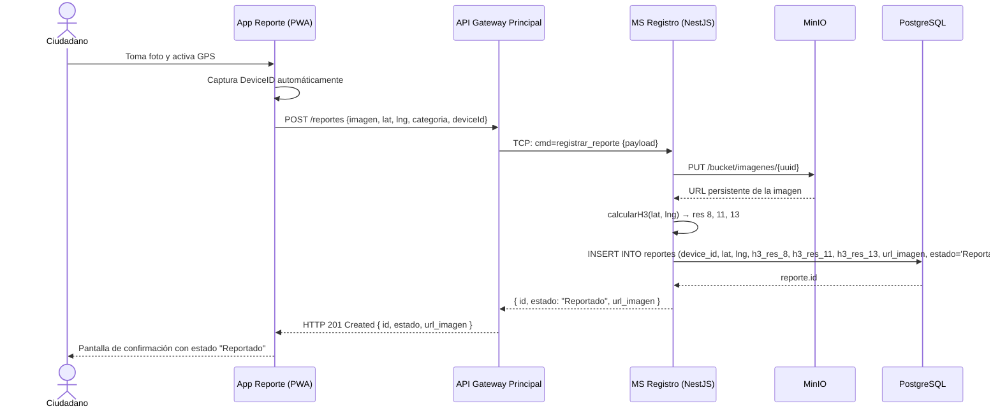
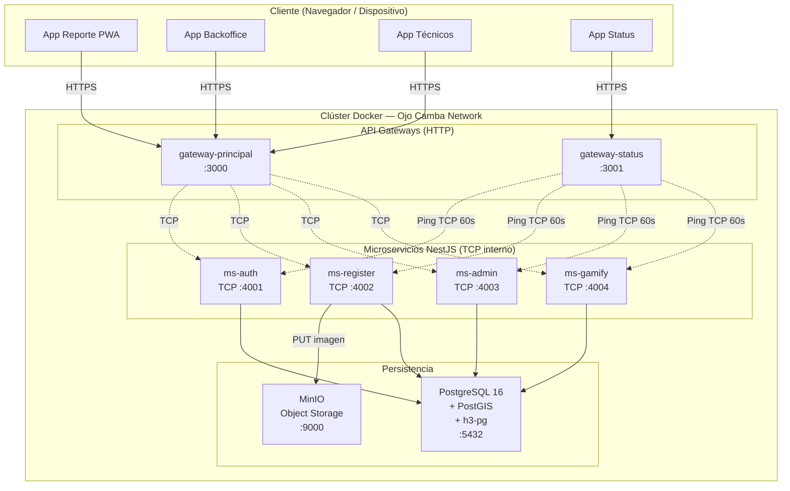

# Diagramas UML 2.5 — Ojo Camba

**Descripción:** Colección de los cinco diagramas UML 2.5 obligatorios del sistema Ojo Camba: Clases, Casos de Uso, Actividades (con swimlanes), Secuencia y Despliegue.

---

## 1. Diagrama de Clases

---

## 2. Diagrama de Casos de Uso

```mermaid
graph TD
    C(["👤 Ciudadano"])
    M(["👤 Moderador / Admin"])
    T(["👤 Técnico en Campo"])
    P(["👤 Usuario Público"])

    subgraph Sistema_Ojo_Camba["Sistema Ojo Camba"]
        CU01["CU-01: Visualizar mapa de calor"]
        CU02["CU-02: Registrar reporte urbano"]
        CU03["CU-03: Crear cuenta de usuario"]
        CU04["CU-04: Consultar bitácora del reporte"]
        CU05["CU-05: Compartir estado del reporte"]

        CU06["CU-06: Ver bandeja de reportes"]
        CU07["CU-07: Cambiar estado del reporte"]
        CU08["CU-08: Agrupar en Caso de Obra"]
        CU09["CU-09: Banear DeviceID"]

        CU10["CU-10: Ver reportes cercanos por H3"]
        CU11["CU-11: Crear Caso de Obra en campo"]
        CU12["CU-12: Registrar actualización en bitácora"]
        CU13["CU-13: Corregir coordenadas GPS"]
        CU14["CU-14: Cambiar estado del Caso de Obra"]

        CU15["CU-15: Ver estado de microservicios"]
    end

    C --> CU01
    C --> CU02
    C --> CU03
    C --> CU04
    C --> CU05

    M --> CU06
    M --> CU07
    M --> CU08
    M --> CU09

    T --> CU10
    T --> CU11
    T --> CU12
    T --> CU13
    T --> CU14

    P --> CU15
```

---

## 3. Diagrama de Actividades — Registro de Reporte (con Swimlanes)

---

## 4. Diagrama de Secuencia — Flujo de Registro de Reporte (HU-01)

---

## 5. Diagrama de Despliegue

