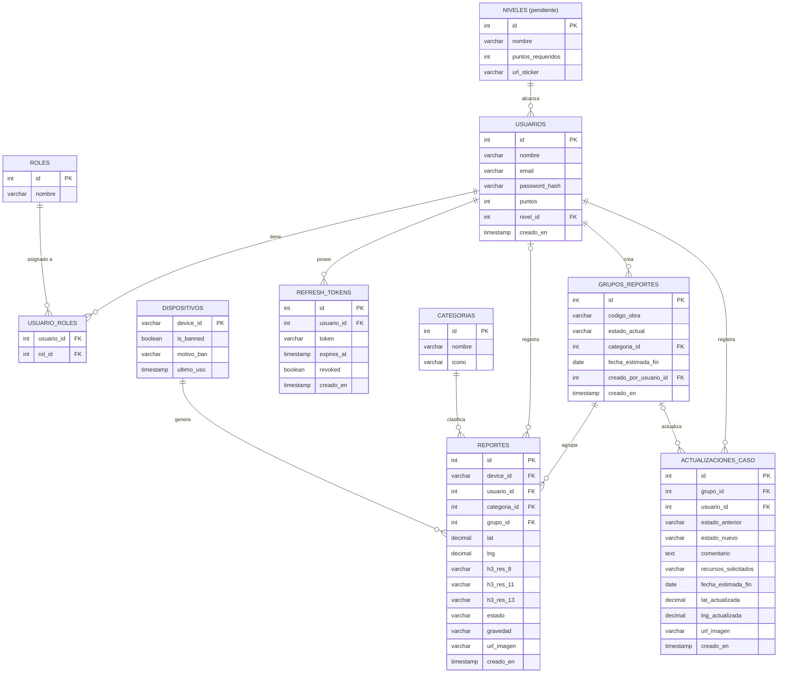

# Archivo: modelo_datos.md

# Modelo de Datos y Esquema Relacional

**Descripción:** Este documento contiene el esquema físico y lógico de la base de datos para la plataforma Ojo Camba, modelado mediante DBML. Define las enumeraciones de estados, el sistema de roles por usuario, el manejo de reportes ciudadanos (incluyendo usuarios anónimos mediante `device_id`), la indexación espacial H3 y la lógica de "Casos de Obra" para agrupar múltiples reportes bajo una misma bitácora de actualizaciones en campo.

## Diagrama Entidad-Relación (ERD)



---

## Código DBML

```dbml
// ==========================================
// PROYECTO: OJO CAMBA - BASE DE DATOS (V3)
// ==========================================

Enum EstadoReporte {
  Reportado
  Aceptado
  Rechazado
  ValidacionEnCampo
  EnTrabajo
  Finalizado
}

Enum Gravedad {
  Baja
  Media
  Alta
  Emergencia
}

// --- USUARIOS Y ROLES ---

Table roles {
  id int [pk, increment]
  nombre varchar [not null]
}

// ⏳ PENDIENTE — entidad de gamificación, no implementada aún (ver HU-06)
Table niveles {
  id int [pk, increment]
  nombre varchar [not null]
  puntos_requeridos int [not null]
  url_sticker varchar
}

Table usuarios {
  id int [pk, increment]
  nombre varchar [not null]
  email varchar [unique, not null]
  password_hash varchar
  puntos int [default: 0]
  nivel_id int [ref: > niveles.id]
  creado_en timestamp [default: `now()`]
}

Table usuario_roles {
  usuario_id int [ref: > usuarios.id]
  rol_id int [ref: > roles.id]
  indexes {
    (usuario_id, rol_id) [pk]
  }
}

Table dispositivos {
  device_id varchar [pk]
  is_banned boolean [default: false]
  motivo_ban varchar
  ultimo_uso timestamp
}

Table refresh_tokens {
  id int [pk, increment]
  usuario_id int [ref: > usuarios.id, not null]
  token varchar [unique, not null]
  expires_at timestamp [not null]
  revoked boolean [default: false]
  creado_en timestamp [default: `now()`]
}

Table categorias {
  id int [pk, increment]
  nombre varchar [not null]
  icono varchar
}

// --- NUEVA ENTIDAD: AGRUPACIÓN DE REPORTES (EL "CASO") ---

Table grupos_reportes {
  id int [pk, increment, note: 'Entidad que agrupa múltiples reportes iguales']
  codigo_obra varchar [unique, note: 'Ej: O-26-0000001 (formato O-YY-NNNNNNN)']
  estado_actual EstadoReporte [default: 'Aceptado', note: 'Solo alcanza Aceptado/ValidacionEnCampo/EnTrabajo/Finalizado — Reportado y Rechazado son estados exclusivos de un Reporte individual antes de agruparse, un Caso de Obra ya formado nunca los alcanza. Transición secuencial obligatoria, sin saltos ni retrocesos.']
  categoria_id int [ref: > categorias.id, null, note: 'Confirmada o corregida por el moderador al aceptar']
  fecha_estimada_fin date [note: 'ETA general de la obra']
  creado_por_usuario_id int [ref: > usuarios.id, note: 'Moderador o técnico que creó el grupo']
  creado_en timestamp [default: `now()`]
}

// --- REPORTES CIUDADANOS ---

Table reportes {
  id int [pk, increment]
  device_id varchar [not null, ref: > dispositivos.device_id]
  usuario_id int [ref: > usuarios.id, null]
  categoria_id int [ref: > categorias.id, not null]
  
  // Relación con el Grupo (En lugar de Parent/Child)
  grupo_id int [ref: > grupos_reportes.id, null, note: 'Todos los reportes con este ID son el mismo problema']
  
  lat decimal [not null]
  lng decimal [not null]
  h3_res_8 varchar [not null]
  h3_res_11 varchar [not null]
  h3_res_13 varchar [not null]
  
  estado EstadoReporte [default: 'Reportado', note: 'Si tiene grupo_id, hereda el estado del grupo']
  gravedad Gravedad [default: 'Media']
  url_imagen varchar [not null]
  
  creado_en timestamp [default: `now()`]
}

// --- ACTUALIZACIONES Y BITÁCORA DE TRABAJO ---

Table actualizaciones_caso {
  id int [pk, increment]
  
  // La actualización siempre va al Caso de Obra (grupo) — nunca a un reporte
  // individual. El campo reporte_id existió en versiones anteriores pero
  // nunca se llegó a usar (ni backend ni frontend lo escribían/leían); se
  // eliminó junto con su columna en el esquema real.
  grupo_id int [ref: > grupos_reportes.id, null]
  
  usuario_id int [ref: > usuarios.id, not null, note: 'Técnico o moderador realizando la actualización']
  
  // Datos del avance diario
  estado_anterior EstadoReporte [null, note: 'Estado del grupo justo antes de esta actualización — nulo si estado_nuevo tambien es nulo (solo comentario, sin cambio de fase)']
  estado_nuevo EstadoReporte [null, note: 'Nulo si es solo un comentario sin cambio de fase. Con valor, debe ser una transición legal según TRANSICIONES_VALIDAS (flujo secuencial obligatorio: Aceptado → ValidacionEnCampo → EnTrabajo → Finalizado)']
  comentario text [not null, note: 'Ej: Día 2 - Retirando escombros']
  recursos_solicitados varchar [null, note: 'Ej: Se solicita volqueta para el día 15']
  fecha_estimada_fin date [null, note: 'Actualización opcional de la fecha de entrega']
  
  // Corrección de GPS en campo
  lat_actualizada decimal [null]
  lng_actualizada decimal [null]
  
  url_imagen varchar [null, note: 'Foto del progreso']
  creado_en timestamp [default: `now()`]

  indexes {
    (grupo_id, creado_en) [note: 'Acelera la reconstrucción histórica día-a-día del Dashboard (getCasosPorEstadoHistorico)']
  }
}

```
